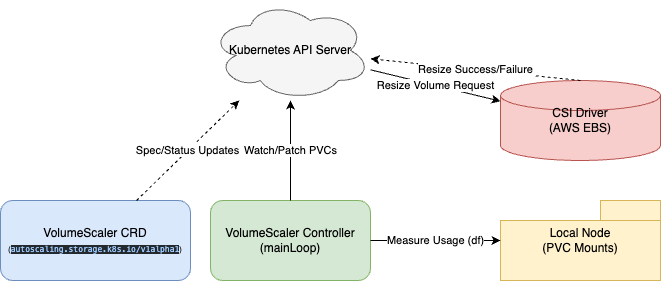

# VolumeScaler

**VolumeScaler** is a Kubernetes controller that automatically scales PersistentVolumeClaims (PVCs) when a specified utilization threshold is reached. It is implemented as a DaemonSet running on each node, monitoring disk usage for PVCs mounted by pods on that node, and dynamically adjusting the PVC request size up to a defined maximum.

## current challenges


When deploying volume in k8s we normally facing the following challenges.

- Under-provisioning → system goes down
- Over-provisioning → wasted cost
- keep watching it every few hours/days to take an actions.

## How VolumeScaler works



## Prerequisites

- Kubernetes 1.17+ (EKS, GKE, AKS, k3s, Minikube, KIND, etc.)
- A StorageClass with `allowVolumeExpansion: true`
- A CSI driver that supports online volume expansion (e.g., EBS CSI, GCE PD CSI, Ceph CSI, or the CSI hostpath driver for local testing)

> **Note:** VolumeScaler reads PVC usage via the standard kubelet `/stats/summary` API. It does not require privileged mode, host path mounts, or any specific storage backend. It works on any Kubernetes cluster where the kubelet reports volume statistics.

## Installation

### Install with kubectl

   ```bash
   git clone git@github.com:aws-samples/sample-volumeScaler.git
   cd sample-volumeScaler && kubectl apply -f volumescaler.yaml
   ```

### Install with Helm

  ```bash
  helm repo add sample-volumeScaler https://aws-samples.github.io/sample-volumeScaler
  helm repo update                                                                 
  helm upgrade --install volumescaler sample-volumeScaler/volumescaler 
  ```

## Deploying on k3s

k3s ships with a `local-path` StorageClass that does not support volume expansion. To test VolumeScaler on k3s, you can either use it as-is (the controller will detect usage and attempt expansion, but the PVC patch will be rejected) or install a CSI driver that supports expansion.

```bash
# Install k3s
curl -sfL https://get.k3s.io | sh -

# Pull the VolumeScaler image
sudo k3s ctr images pull public.ecr.aws/ghanem/volumescaler:v0.2.0

# Deploy VolumeScaler
sudo k3s kubectl apply -f volumescaler.yaml

# Verify the DaemonSet is running
sudo k3s kubectl get ds volumescaler-daemonset
sudo k3s kubectl get pods -l app=volumescaler

# Create a test PVC and VolumeScaler CR
cat <<EOF | sudo k3s kubectl apply -f -
apiVersion: v1
kind: PersistentVolumeClaim
metadata:
  name: test-pvc
spec:
  accessModes: [ReadWriteOnce]
  resources:
    requests:
      storage: 1Gi
  storageClassName: local-path
---
apiVersion: v1
kind: Pod
metadata:
  name: data-gen
spec:
  containers:
    - name: data-gen
      image: busybox
      command: ["sh", "-c", "sleep 3600"]
      volumeMounts:
        - name: data
          mountPath: /data
  volumes:
    - name: data
      persistentVolumeClaim:
        claimName: test-pvc
---
apiVersion: autoscaling.storage.k8s.io/v1alpha1
kind: VolumeScaler
metadata:
  name: test-vs
spec:
  pvcName: test-pvc
  threshold: "50%"
  scale: "50%"
  scaleType: VolumeScaler
  cooldownPeriod: "1m"
  maxSize: 3Gi
EOF

# Write data to trigger threshold detection
sudo k3s kubectl exec data-gen -- dd if=/dev/zero of=/data/fill bs=1M count=600

# After ~60s, check usage status
sudo k3s kubectl get vs test-vs
```

> **Note:** The `local-path` StorageClass does not support volume expansion, so the PVC patch will fail with a "forbidden" error. This is expected — the controller correctly detects usage and attempts expansion. To test full end-to-end expansion on k3s, install a CSI driver that supports online expansion.

## Deploying on Minikube

Minikube's default `standard` StorageClass uses a hostpath provisioner that does not report PVC volume stats to the kubelet. To get proper volume metrics, enable the CSI hostpath driver addon.

```bash
# Start minikube
minikube start --driver=docker

# Enable the CSI hostpath driver addon
minikube addons enable csi-hostpath-driver

# Patch the CSI StorageClass to allow volume expansion
kubectl patch sc csi-hostpath-sc -p '{"allowVolumeExpansion": true}'

# Deploy VolumeScaler
kubectl apply -f volumescaler.yaml

# Verify the DaemonSet is running
kubectl get ds volumescaler-daemonset
kubectl get pods -l app=volumescaler

# Create a test PVC (using csi-hostpath-sc) and VolumeScaler CR
cat <<EOF | kubectl apply -f -
apiVersion: v1
kind: PersistentVolumeClaim
metadata:
  name: test-pvc
spec:
  accessModes: [ReadWriteOnce]
  resources:
    requests:
      storage: 1Gi
  storageClassName: csi-hostpath-sc
---
apiVersion: v1
kind: Pod
metadata:
  name: data-gen
spec:
  containers:
    - name: data-gen
      image: busybox
      command: ["sh", "-c", "sleep 3600"]
      volumeMounts:
        - name: data
          mountPath: /data
  volumes:
    - name: data
      persistentVolumeClaim:
        claimName: test-pvc
---
apiVersion: autoscaling.storage.k8s.io/v1alpha1
kind: VolumeScaler
metadata:
  name: test-vs
spec:
  pvcName: test-pvc
  threshold: "50%"
  scale: "50%"
  scaleType: VolumeScaler
  cooldownPeriod: "1m"
  maxSize: 3Gi
EOF

# Write data to trigger threshold
kubectl exec data-gen -- dd if=/dev/zero of=/data/fill bs=1M count=600

# After ~60s, check usage and scaling status
kubectl get vs test-vs
```

> **Note:** The CSI hostpath driver shares the host filesystem across all PVCs, so the raw usage reported by the kubelet may exceed the PVC size. VolumeScaler caps the displayed values at 100% usage and the PVC spec size so that `kubectl get vs` always shows sensible numbers. On production CSI drivers (EBS, GCE PD, Azure Disk, Ceph RBD), usage numbers are accurate per-volume. The full expansion flow (1Gi → 2Gi → 3Gi → reachedMaxSize) works correctly on minikube with the CSI hostpath driver.

## Testing
 **Deploy pod-data-generator for testing**:

  ```bash
  kubectl apply -f test-pod-data-generator.yaml
  ```

## How It Works

### 1. VolumeScaler

Define a VolumeScaler custom resource in the same namespace as the PVC. It should specify:

- `pvcName`: The name of the PVC to monitor
- `threshold`: Utilization threshold in percentage (e.g., 70%)
- `scale`: The percentage increase in PVC size when threshold is exceeded (e.g., 30%)
- `maxSize`: The maximum PVC size (e.g., 100Gi)
it is just all about predictable and unpredictable workload
- `scaleType`: it is just all about predictable and unpredictable workload
  - percentage: for unpredictable workload
  - Fixed: for predictable workload

### 2. Monitoring Utilization

The DaemonSet runs on every node, querying the kubelet `/stats/summary` API for PVC usage metrics. For each PVC-backed volume on the node, the kubelet reports `usedBytes`, `capacityBytes`, and `availableBytes`. The controller recalculates usage percentage against the PVC spec size and compares it against the threshold from the matching VolumeScaler resource.

You can view current utilization directly:

```bash
kubectl get vs
```

```
NAME         PVC NAME      USAGE%   USED    SIZE   THRESHOLD   MAX SIZE   REACHED MAX
example-vs   example-pvc   67       3.2Gi   5Gi    70%         10Gi       false
```

### 3. Scaling PVC

If the utilization is above the threshold and cooldown conditions are met (not scaled recently), the controller:

- Calculates the new size based on the scale percentage
- Ensures it does not exceed maxSize
- Patches the PVC to request the new size
- Updates the VolumeScaler status with the time of the last scale

### 4. Reaching Max Size

When the PVC reaches or is near the maxSize, the VolumeScaler status is updated to indicate `reachedMaxSize`. No further scaling is performed once this is true.

## Example VolumeScaler

```yaml
apiVersion: autoscaling.storage.k8s.io/v1alpha1
kind: VolumeScaler
metadata:
  name: example-pvc
  namespace: default
spec:
  pvcName: example-pvc
  threshold: "70%"
  scaleType: "percentage"        # "fixed" or "percentage"
  scale: "30%"
  maxSize: "10Gi"
```

You can check [this Demo](https://www.youtube.com/watch?v=kNfBlW0LXlU) for better understanding.

## Contributing

Contributions are welcome! Please open issues or pull requests on the repository for bug fixes, new features, or documentation improvements.

## License

This project is licensed under the MIT License. See [LICENSE](LICENSE) for details.
