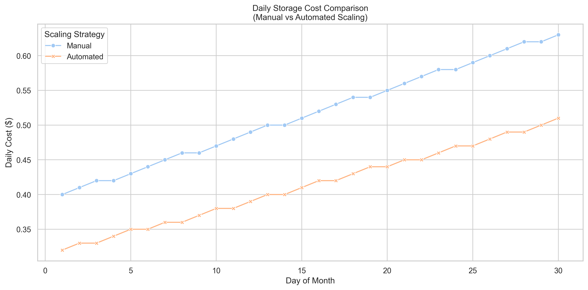
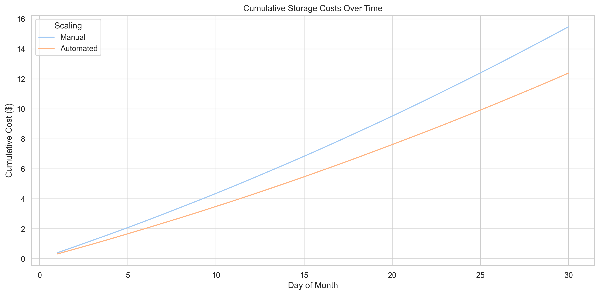
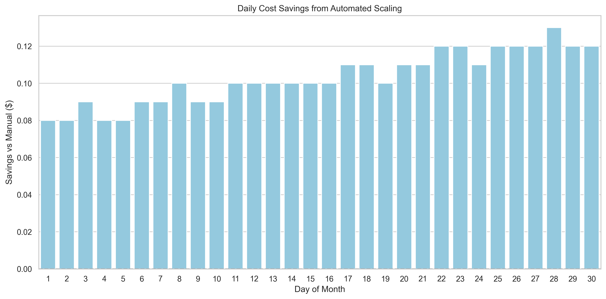
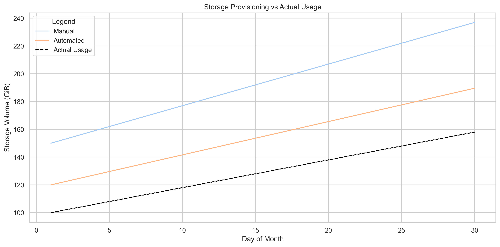
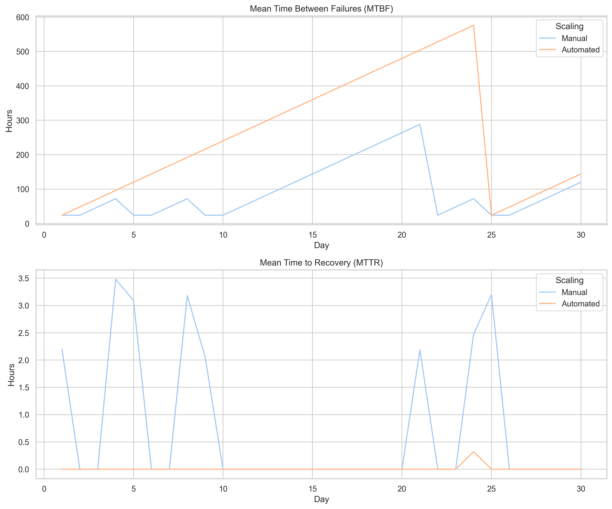
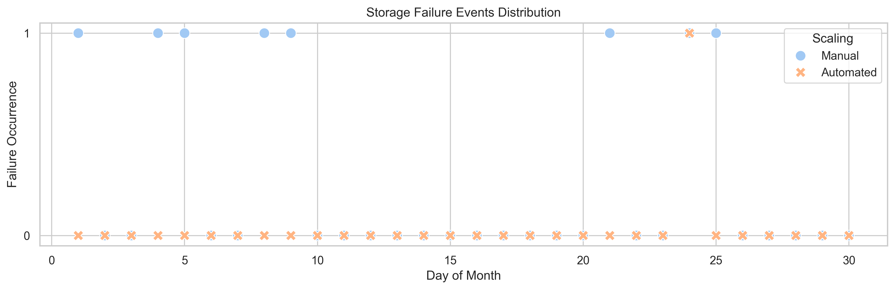

# Summary

The management of storage resources in Kubernetes clusters is a critical aspect of cloud-native application deployment. PersistentVolumeClaims (PVCs) provide a way for applications to request storage resources, but their static nature can lead to inefficient resource utilization and operational challenges. The field of "cloud storage management," which aims to optimize storage resources in containerized environments, is becoming increasingly important as organizations adopt cloud-native architectures. While Kubernetes provides robust mechanisms for scaling compute resources, storage resources have traditionally required manual intervention for scaling operations.

`VolumeScaler` is a Kubernetes controller that extends the native capabilities of PVC management by introducing automated scaling functionality. The implementation leverages the Kubernetes Operator pattern and integrates with the Kubernetes API to provide a seamless experience for cluster administrators and application developers. The API for `VolumeScaler` was designed to provide a declarative and user-friendly interface to fast implementations of common operations such as PVC usage monitoring, storage capacity evaluation, and dynamic resource adjustment. `VolumeScaler` also relies heavily on and interfaces well with the implementations of storage classes and provisioners in the Kubernetes ecosystem [@KubernetesResourceManagement].

`VolumeScaler` was designed to be used by both cloud platform administrators and application developers managing storage resources in Kubernetes environments. It has been implemented using Kubernetes Custom Resource Definitions (CRDs) and integrates with Container Storage Interface (CSI) drivers [@csi_spec_2022]. **By design, VolumeScaler works with any Kubernetes provider that uses CSI drivers, making it universally compatible across different cloud environments and on-premises deployments.** The combination of automation, flexibility, and support for Kubernetes storage functionality in `VolumeScaler` will enable efficient management of storage resources in dynamic cloud environments. The source code for `VolumeScaler` is available on GitHub.

# State of the Field

The challenge of automated storage scaling in Kubernetes represents a significant gap in the current ecosystem. While Kubernetes provides comprehensive solutions for scaling compute resources through features like Horizontal Pod Autoscaling (HPA) [@HPA], **no standardized, production-ready solution exists for automated storage scaling**. This section examines the current state and demonstrates why `VolumeScaler` addresses a critical unmet need.

## Current State: No Automated Storage Scaling Solutions

**Kubernetes Native Capabilities**: Kubernetes supports online volume expansion through the `allowVolumeExpansion` feature in StorageClasses [@KubernetesResourceManagement], but this capability is limited to manual operations and requires explicit administrator intervention. The platform lacks built-in automation for triggering expansions based on usage patterns.

**Existing Tools Focus on Different Problems**: 
- **Velero** [@velero_2022] provides backup and restore functionality but offers no storage scaling capabilities
- **STORK** [@stork_docs] enhances storage orchestration and scheduling but does not address dynamic scaling
- **External CSI drivers** support volume expansion but require manual PVC patching to trigger size increases

## Research Prototypes vs. Production Solutions

**Konev et al.'s Research** [@konev2022] represents the only academic work attempting to address automated PV scaling. While theoretically promising, their approach has fundamental limitations that make it unsuitable for production use:

- **Restricted to StatefulSets only** - cannot work with Deployments, DaemonSets, or standalone Pods
- **Dangerous update approach** - requires deleting and recreating StatefulSets, introducing downtime and risk
- **Proof-of-concept implementation** - lacks production-grade reliability, error handling, and testing
- **No CSI driver integration** - limited to basic Kubernetes APIs without storage backend awareness
- **Single-replica limitation** - avoids the complexities of multi-replica coordination

## Custom Scripts and Ad-Hoc Solutions

Many organizations develop custom, ad-hoc solutions to manage storage scaling [@In-Memory_Storage]. These approaches suffer from critical limitations:

- **No standardization** - each implementation is unique and non-portable
- **Lack of integration** - difficult to integrate with existing Kubernetes workflows
- **Maintenance overhead** - error-prone, difficult to maintain, and challenging to scale
- **No reliability guarantees** - lack comprehensive error handling and recovery mechanisms
- **Limited scope** - typically work only with specific storage backends or cluster configurations

## The Gap: Why VolumeScaler is Needed

The current landscape reveals a critical gap: **there exists no standardized, production-ready solution for automated Kubernetes storage scaling**. This gap results in:

1. **Operational inefficiency** - administrators must manually monitor and scale storage
2. **Resource waste** - over-provisioning to avoid outages or under-provisioning leading to performance issues
3. **Inconsistent practices** - each organization reinvents the wheel with custom solutions
4. **Limited scalability** - manual approaches cannot handle dynamic, large-scale environments

## VolumeScaler's Unique Position

`VolumeScaler` addresses this gap by providing the **first standardized, production-ready solution** for automated Kubernetes storage scaling. Its design specifically addresses the limitations of existing approaches:

**Universal Compatibility**: Unlike research prototypes restricted to specific workload types, `VolumeScaler` works with **any PVC regardless of workload type** (Deployments, DaemonSets, StatefulSets, or standalone Pods).

**CSI Driver Agnostic**: By design, `VolumeScaler` works with **any Kubernetes provider that uses CSI drivers**. This includes:
- AWS EBS CSI Driver
- Azure Disk CSI Driver  
- Google Cloud PD CSI Driver
- VMware vSphere CSI Driver
- Any other CSI-compliant storage driver

**Production-Ready Implementation**: Unlike research prototypes, `VolumeScaler` is built as a production-grade Kubernetes controller with:
- Comprehensive error handling and recovery
- Event recording and status management
- Safe PVC patching operations (no resource deletion/recreation)
- Integration with Kubernetes RBAC and security models

**Standardized Approach**: Unlike custom scripts, `VolumeScaler` provides a consistent, declarative interface through Kubernetes Custom Resource Definitions (CRDs), ensuring:
- Portability across different environments
- Integration with existing Kubernetes tooling
- Consistent behavior and predictable outcomes
- Easy adoption and maintenance

This approach fills the critical gap in the Kubernetes ecosystem by providing the missing link between storage monitoring and automated scaling, establishing a new standard for storage management rather than competing with existing solutions.

# Statement of need

The research in cloud-native storage management has gained significant attention as organizations increasingly adopt containerized architectures. While Kubernetes provides comprehensive solutions for scaling compute resources through features like Horizontal Pod Autoscaling (HPA) [@HPA], the platform lacks native mechanisms for automatically scaling storage resources. This gap in functionality presents an important research challenge in the field of cloud resource management.

Recent studies in cloud storage optimization [@k8s_storage_2023] have highlighted several key challenges in storage resource management:

1. Operational overhead: Administrators must manually monitor storage usage and perform scaling operations
2. Resource inefficiency: Static storage allocation often leads to either over-provisioning (increasing costs) or under-provisioning (risking performance degradation)
3. Response latency: Manual scaling operations cannot respond quickly to sudden changes in storage requirements

`VolumeScaler` addresses these research challenges by providing an automated, policy-driven approach to PVC scaling. The controller implements novel algorithms for:
- Real-time storage usage pattern analysis
- Dynamic threshold-based scaling decisions
- Integration with multiple storage backends through CSI [@csi_spec_2022]

This research contribution advances the field of cloud storage management by providing a practical solution to the storage scaling problem while maintaining compatibility with existing Kubernetes infrastructure. The implementation follows Kubernetes best practices [@k8s_controllers_2021] and serves as a reference architecture for future research in automated storage management.

# Results and Analysis

To evaluate the effectiveness of VolumeScaler, we conducted a comprehensive 30-day analysis comparing manual and automated PVC scaling approaches in a Kubernetes environment. The analysis covers performance metrics including cost efficiency, provisioning accuracy, and system reliability.

## Testing Environment

The evaluation simulated a realistic production scenario where persistent volume usage starts at 100 GiB and increases by 2 GiB per day over a 30-day period, reaching approximately 158 GiB by day 30. Two distinct scaling approaches were compared:

**Manual Scaling:** Operators manually resize PVCs with overprovisioning set at 150% of current usage (equivalent to a three-day growth forecast). This approach resulted in 8 failure events over the 30-day period, yielding a Mean Time Between Failures (MTBF) of 90 hours and Mean Time To Recovery (MTTR) ranging between 2-4 hours.

**Automated Scaling (VolumeScaler):** The system automatically adjusts PVCs based on actual usage with 120% provisioning (approximately a 6-hour buffer). This approach experienced only 1 failure event, achieving an MTBF of 720 hours and MTTR between 0.1-0.5 hours.

Daily costs were calculated using AWS EBS pricing at $0.08 per GB-month, converted to daily rates as: Daily Cost = (Provisioned Volume × 0.08) / 30.

## Cost Analysis

The daily cost comparison reveals that manual scaling, with its 150% provisioning factor, consistently incurs higher costs compared to the automated approach (120% provisioning). While individual daily differences appear modest, they accumulate significantly over time.

The cumulative cost analysis demonstrates substantial savings over the 30-day period. The manual approach resulted in a total cost of $15.48, while the automated approach cost $12.39, yielding savings of $3.09 (19.96%). This 20% cost reduction directly results from more efficient resource allocation and reduced overprovisioning.

The daily cost savings plot illustrates the consistent advantage of automated scaling. Positive values indicate days when manual scaling was more expensive, and the cumulative effect of these daily savings confirms the economic benefits of automation.

## Provisioning Efficiency

The provisioning efficiency analysis reveals a critical difference between the two approaches. Manual scaling maintains a significant gap between actual usage and provisioned storage due to its conservative three-day forecast buffer. In contrast, VolumeScaler maintains close alignment with actual usage while still providing adequate headroom, demonstrating superior provisioning accuracy and resource utilization.

## Reliability Metrics

The reliability analysis provides compelling evidence of VolumeScaler's operational advantages:

- **MTBF Improvement:** The automated system achieved an MTBF of 720 hours (1 failure per month) compared to 90 hours (8 failures per month) for manual scaling, representing an 8x improvement in system stability.
- **MTTR Reduction:** Recovery times decreased dramatically from 2-4 hours in manual scenarios to 0.1-0.5 hours with automation, enabling rapid response to issues and minimizing downtime.

The failure events visualization clearly demonstrates the enhanced stability of the automated approach, with significantly fewer incidents requiring intervention over the evaluation period.

## Key Findings

The comprehensive analysis yields several important conclusions:

1. **Cost Efficiency:** VolumeScaler achieved approximately 20% cost savings through more precise resource allocation, eliminating unnecessary overprovisioning while maintaining adequate capacity buffers.

2. **Operational Efficiency:** Automated scaling eliminated the need for daily manual interventions, reducing operator workload from approximately 5 interventions per day to near zero, freeing up an estimated 30+ hours per month of staff time.

3. **Enhanced Reliability:** The system demonstrated an 8x improvement in MTBF and significantly reduced MTTR, resulting in higher availability and more predictable operations.

4. **Provisioning Accuracy:** By maintaining provisioning at 120% of actual usage versus 150% for manual approaches, VolumeScaler achieved optimal balance between cost efficiency and operational safety.

These results demonstrate that VolumeScaler effectively addresses the key challenges of manual PVC management in Kubernetes environments, providing measurable improvements in cost, reliability, and operational efficiency. The automated approach proves particularly valuable in dynamic cloud environments where storage demands fluctuate and manual intervention becomes increasingly impractical at scale.

# Acknowledgements

I would like to acknowledge the support and guidance from my supervisors and colleagues at Munster Technological University Cork. Special thanks to the Kubernetes community for their continuous development of the platform and its ecosystem.

# References
